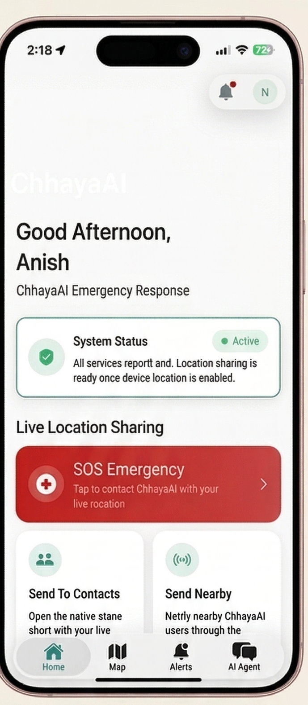
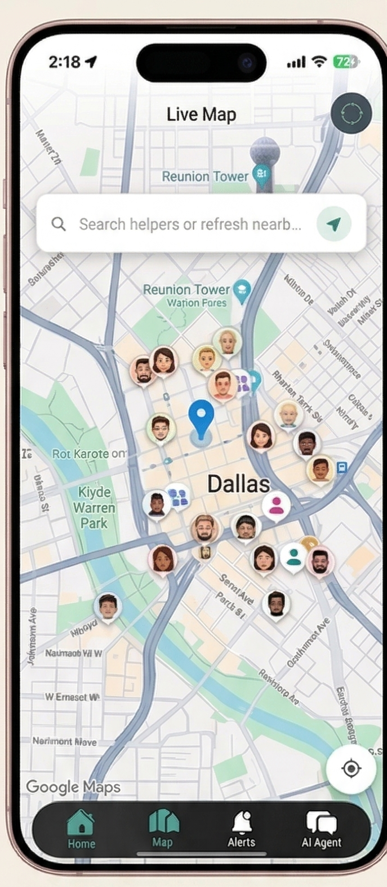
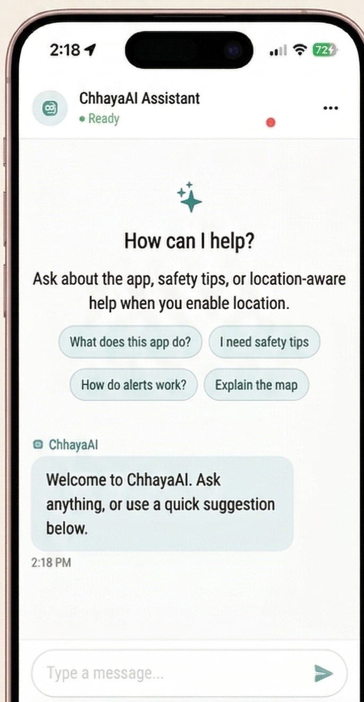
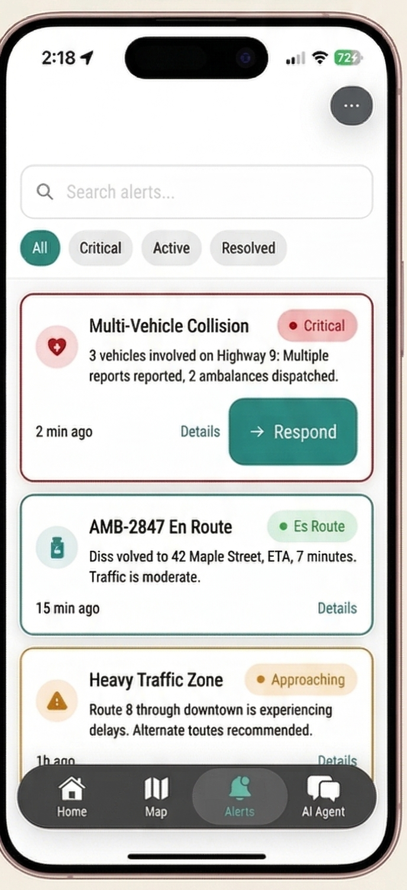

# ChhayaAI

A native iOS emergency response app with real-time location sharing, AI-powered assistance, and a multi-agent backend. Built for situations where seconds matter.

---

### Dashboard



Your command center. One tap on the SOS button triggers the full emergency flow. Below it, you see the nearest ambulance, fire truck, and police unit with live distance calculations. Quick actions let you call 911, share your location, or message a friend instantly.

---

### Live Map



Emergency operators appear as colored markers: red for ambulances, orange for fire trucks, blue for police. Tap any marker to see details, distance, phone number, and status. Friends you've added show up here too, updating in real-time as they move.

---

### AI Assistant



Ask anything. The backend classifies your intent and routes to specialized agents. Need help? It triggers an alert. Looking for directions? It updates the map. Just want to talk? It responds conversationally. All powered by a multi-agent system running on Cloud Run.

---

### Notifications



Friend requests, accepted connections, and SOS alerts all appear here. When someone adds you or needs help, you'll know immediately.

---

## What it does

ChhayaAI connects people who need help with people who can provide it. Users share their live location with trusted contacts, trigger SOS alerts that dispatch nearby responders, and get AI-assisted guidance during emergencies.

The app tracks emergency operators (ambulances, fire trucks, police) on a live map, computes distances in real-time, and lets users call responders directly from the interface.

### Core features

**Live location sharing** — Share your position with close friends in real-time. Both parties see each other on the map while the app is open. Built on Firestore snapshot listeners, so updates appear within seconds.

**SOS emergency flow** — One tap triggers a multi-step flow: the backend logs an alert, finds nearby helpers, dispatches notifications, and returns map markers showing who is responding. The app can also initiate a 911 call.

**Emergency operator tracking** — 30 synthetic emergency vehicles (ambulances, fire trucks, police) are seeded into Firestore. The app displays them on the map with type-specific colors, computes distance from the user, and shows phone numbers and status. This simulates what a production integration with real dispatch APIs would look like.

**Close friends system** — Users search by email, send friend requests, and accept or decline incoming requests. Accepted friends appear on the live map and receive SOS alerts. The data model uses Firestore subcollections with mirrored documents so both parties can read and write their own friend list.

**AI chat assistant** — A conversational interface backed by a FastAPI service running on Cloud Run. The backend classifies user intent (MAP, ALERT, DATA) using an LLM, then routes to specialized agents. Chat history is stored in Redis.

## Architecture

```
┌─────────────────────────────────────────────────────────────────┐
│                         iOS App (SwiftUI)                       │
├─────────────────────────────────────────────────────────────────┤
│  AuthService          Firebase Auth sign-in/sign-up             │
│  LocationManager      CoreLocation, throttled GPS updates       │
│  FriendService        Firestore listeners for friend requests   │
│  EmergencyOperatorService  Firestore listener + distance calc   │
│  AgentAPIClient       HTTPS to FastAPI backend on Cloud Run     │
│  UserProfileStore     Firestore user profile sync               │
├─────────────────────────────────────────────────────────────────┤
│  MapView              Google Maps SDK, colored markers, cards   │
│  DashboardView        SOS button, nearby units, quick actions   │
│  ChatView             AI assistant, message bubbles, suggestions│
│  FriendsHubView       Search, incoming/outgoing requests, list  │
│  AlertFeedView        Alert history and status                  │
└─────────────────────────────────────────────────────────────────┘
                              │
                              ▼
┌─────────────────────────────────────────────────────────────────┐
│                    FastAPI Backend (Cloud Run)                  │
├─────────────────────────────────────────────────────────────────┤
│  POST /v1/chat        Single endpoint, schema-validated JSON    │
│  Supervisor           Routes to ALERT / MAP / DATA agents       │
│  AlertAgent           Priority classification, dispatch logic   │
│  MapAgent             Location matching, GQL query builder      │
│  DataAgent            General chat, LLM completion via Groq     │
│  LLMClient            Intent classification, chat completions   │
│  RedisClient          Session-scoped chat history               │
│  AuthValidator        Optional Firebase ID token verification   │
└─────────────────────────────────────────────────────────────────┘
                              │
                              ▼
┌─────────────────────────────────────────────────────────────────┐
│                       Cloud Infrastructure                      │
├─────────────────────────────────────────────────────────────────┤
│  Firebase Auth        Email/password authentication             │
│  Firestore            Users, friends, live_locations, operators │
│  Cloud Run            Stateless container, auto-scaling         │
│  Groq API             LLM inference (llama-3.3-70b-versatile)   │
│  Redis (optional)     Chat history persistence                  │
│  Google Maps SDK      Map rendering, marker clustering          │
└─────────────────────────────────────────────────────────────────┘
```

## Tech stack

### iOS

| Layer | Technology |
|-------|------------|
| UI framework | SwiftUI |
| State management | @Observable, @Environment |
| Authentication | Firebase Auth |
| Real-time database | Firestore (snapshot listeners) |
| Maps | Google Maps SDK for iOS |
| Location | CoreLocation |
| Networking | URLSession, async/await |
| Design system | Custom tokens (spacing, colors, typography, shadows) |

### Backend

| Layer | Technology |
|-------|------------|
| Framework | FastAPI |
| Hosting | Google Cloud Run |
| LLM provider | Groq (llama-3.3-70b-versatile) |
| Session storage | Redis |
| Auth validation | Firebase Admin SDK (optional) |
| Database (planned) | Cloud Spanner with GQL graph queries |

### Infrastructure

| Service | Purpose |
|---------|---------|
| Firebase Auth | User identity |
| Firestore | Real-time document sync |
| Cloud Run | Serverless backend |
| Google Maps Platform | Map tiles, markers, directions |

## Project structure

```
ChhayaAI/
├── ChhayaAI/                    # iOS app source
│   ├── ChhayaAIApp.swift        # App entry, environment injection
│   ├── ContentView.swift        # Tab navigation
│   ├── Features/
│   │   ├── Auth/                # Login, SignUp views
│   │   ├── Chat/                # AI assistant interface
│   │   ├── Dashboard/           # Home screen, SOS button
│   │   ├── Feed/                # Alert history
│   │   ├── Friends/             # Close friends management
│   │   └── Map/                 # Live map with markers
│   ├── Services/
│   │   ├── AuthService.swift
│   │   ├── FriendService.swift
│   │   ├── EmergencyOperatorService.swift
│   │   ├── LocationManager.swift
│   │   ├── AgentAPIClient.swift
│   │   ├── FirestoreModels.swift
│   │   └── ...
│   ├── DesignSystem/
│   │   ├── Tokens/              # Spacing, colors, typography
│   │   └── Components/          # Buttons, cards, badges
│   └── Navigation/
│       └── AppTab.swift
│
├── ai_agent_service/            # Python backend
│   ├── app/
│   │   ├── main.py              # FastAPI app, /v1/chat endpoint
│   │   ├── config.py            # Environment loading
│   │   ├── agents/
│   │   │   ├── supervisor.py    # Intent routing
│   │   │   ├── alert_agent.py   # Emergency dispatch
│   │   │   ├── map_agent.py     # Location matching
│   │   │   ├── data_agent.py    # General chat
│   │   │   └── llm_client.py    # Groq API wrapper
│   │   ├── schemas/
│   │   │   └── request_response.py
│   │   ├── auth/
│   │   │   └── validator.py
│   │   ├── memory/
│   │   │   └── redis_client.py
│   │   └── db/
│   │       └── spanner_client.py
│   ├── seed_firestore.py        # Seed script for test data
│   ├── requirements.txt
│   ├── Dockerfile
│   └── deploy.sh
│
├── firestore-rules.txt          # Security rules for Firestore
├── Secrets.xcconfig             # Build-time secrets (gitignored values)
└── Info.plist
```

## Implementation highlights

### Multi-agent supervisor

The backend uses a supervisor pattern. Every request goes to `POST /v1/chat` with a trigger type. The supervisor:

1. Sanitizes the query and validates location
2. Classifies intent using an LLM (or hardcoded triggers like `EMERGENCY_BUTTON`)
3. Routes to the appropriate agent (ALERT, MAP, or DATA)
4. Normalizes the response into a consistent JSON envelope

For emergency flows, the supervisor runs MAP and ALERT agents in sequence, merges their outputs, and returns a combined payload.

### Real-time friend sync

The iOS `FriendService` attaches three Firestore snapshot listeners:
- Incoming friend requests (where `toUid == currentUser`)
- Outgoing friend requests (where `fromUid == currentUser`)
- Accepted friends (subcollection under the user's document)

When a user accepts a request, a batch write updates the request status and creates mirrored friend documents in both users' subcollections.

### Emergency operator distance calculation

`EmergencyOperatorService` listens to the `emergency_operators` collection. When the user's location changes, it recomputes distances using `CLLocation.distance(from:)` and sorts operators by proximity. The `nearestByType` property returns the closest ambulance, fire truck, and police unit for the dashboard summary.

### Design system

The app uses a three-tier color system:
1. **Brand colors** — Raw palette values
2. **Semantic colors** — Meaningful aliases (textPrimary, statusError, actionPrimary)
3. **Component colors** — Context-specific bindings (Card.bg, Button.primaryBg)

Typography, spacing, radius, and shadow tokens follow the same pattern.

## Seeding test data

The backend includes a seed script that populates Firestore with:
- 100 synthetic users with random locations around Chicago
- 30 emergency operators (10 ambulances, 10 fire trucks, 10 police)
- 100 live location documents
- 20 friend requests to a specified email address

```bash
export GOOGLE_APPLICATION_CREDENTIALS="$HOME/keys/chhayaai-firestore-seeder.json"
cd ai_agent_service
source venv/bin/activate
python seed_firestore.py
```

## What makes this project interesting

**Full-stack mobile + backend** — Native iOS app with a Python backend, both deployed to production infrastructure. The iOS side uses modern SwiftUI patterns (@Observable, async/await). The backend is a multi-agent system with intent classification.

**Real-time data flow** — Firestore snapshot listeners push updates to the app without polling. Location changes propagate to friends within seconds.

**Emergency-first design** — The SOS flow is designed to work fast: one tap, location validation, parallel agent execution, merged response. The UI shows clear status at every step.

**Production infrastructure** — Firebase Auth, Firestore, Cloud Run, Google Maps. The app connects to real services, not local mocks.

**Clean separation** — The iOS app knows nothing about LLMs or agent routing. The backend knows nothing about UIKit. They communicate through a single JSON contract.

## Status

The app is functional for:
- User auth (sign up, sign in, sign out)
- Close friends (search, request, accept, decline)
- Live map with emergency operators
- AI chat assistant
- SOS emergency flow (triggers backend, shows response)

Not yet wired:
- Push notifications (FCM setup pending)
- Real emergency dispatch APIs
- Cloud Spanner persistence (stubbed)
- Background location updates

## Authors

Anish KC

Nikesh Paudyal

Piyush Singh
